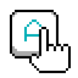

# Another Touchboard Server



Replace Your Keyboard with a Touch Device.

## Overview
Another Touchboard Server enables you to use a touch device (like a smartphone or tablet) as a wireless keyboard for your computer. It establishes a network connection between your touch device and computer, allowing touch inputs to be translated into keyboard commands.

## Features
- Wireless connection via Wi-Fi
- Real-time key press simulation
- Client heartbeat monitoring
- Simple and intuitive UI
- LAN auto-discovery

## How It Works
1. Run the server on your computer
2. Connect your touch device using the [Another Touchboard Client](https://github.com/another-device/another-touchboard-client)
3. Start using your touch device as a keyboard

## Installation
1. Clone this repository:
   ```bash
   git clone https://github.com/another-device/another-touchboard-server.git
   ```
2. Build the project using .NET 8.0 or later
3. Run the executable

## Usage
- Launch the server application
- The server will automatically start broadcasting on your local network
- Connect your touch device through the client app
- Use the touch interface to send keyboard inputs

## License
This project is licensed under the MIT License - see the [LICENSE](LICENSE) file for details.
